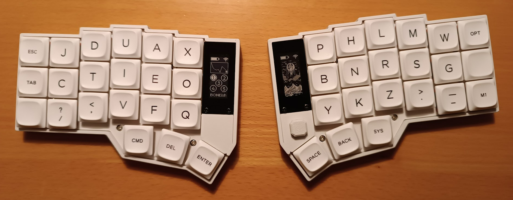
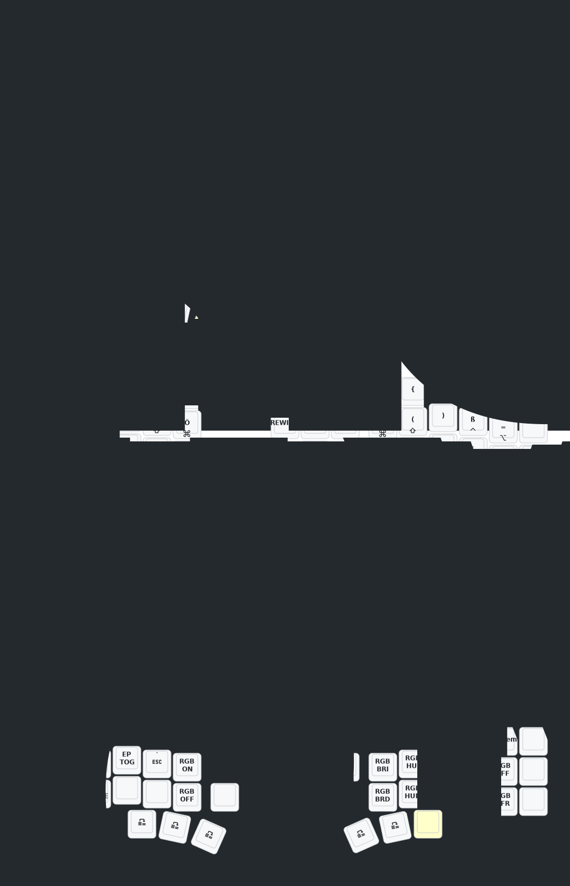
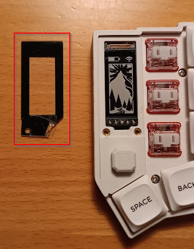
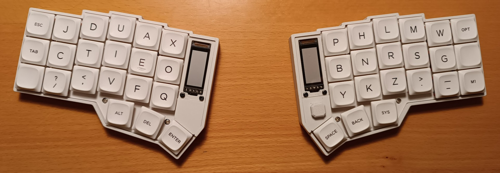

# Eyelash Corne ZMK Repository with BONEish DE-Layout

This is a fork of [zmk-new_corne](https://github.com/a741725193/zmk-new_corne) - for further instuctions go there.

Also checkput the [AliExpress Eyelash Corne Basic Beginner Guide (From a beginner)](https://www.reddit.com/r/ErgoMechKeyboards/comments/1ju67yx/aliexpress_eyelash_corne_basic_beginner_guide/).

## Notes

The Eyelash Corne is a wireless Corne variant with USB-C connectors and on/off-switch on both halfs. The full featured one has a display on both halfs and a roller on the left and a joystick on the right side, but there are also striped down variants. It can connect to 5 different BT devices - these are the profiles 1 to 5 shown in the display of the left half.

If USB output is active you can connect it by cable from the left half. See the keymap where to enable USB output - the display of the left side shows the state.

You can do a live editing of the mappings in [ZMK Studio](https://zmk.studio/) in the browser when connected by USB cable or download the app from https://zmk.studio/download and use both, USB & BT.

The [Keymap Editor](https://nickcoutsos.github.io/keymap-editor/) offers more control and is nicer to use, but it requires to have a own repo.

I added DE keycodes from https://github.com/joelspadin/zmk-locale-generator/releases and modified the keymap_drawer.config.yaml to show the keys as I want them. If you enable the Actions, the firmware and keymap diagram get automatically built on GitHub.  From the built action you can download the new firmware as a ZIP which contains three files: settings_reset-eyelash_corne_left-zmk.uf2, eyelash_corne_studio_left.uf2, nice_view-eyelash_corne_right-zmk.uf2.

To flash the new firmware switch off both halfs, connect the left half by USB and press the reset button on the bottom twice with a paperclip. A new drive named `NICENANO` will show up. Copy `left_eyelash_corne.uf2` to it. Windows sometimes complains that the copy failed as the half will disconnect directly after the copy operation - do not worry just go on. Disconnect left half and connect right half and press the reset button on the bottom twice and copy `right_eyelash_corne.uf2` to the drive `NICENANO`. Now disconnect the right half, switch on the left half first, then the right half second.
If you have flashed the wrong file to a half, or in certain other situations, you may need to flash `reset_settings_eyelash_corne.uf2` to each half first, before flashing the half-specific firmware file.

## Config

The config contains some additional behaviors:
* &caps_word_de to handle also äüö
* &altgr macro to add some delay to AltGr bindings to work in RDP - without this RDP eventually swallows AltGr modifier and sends only key
* 😀 in symbol layer is bound to Gui-Space which opens https://github.com/gilleswaeber/emoji-keyboard

## Keymap Diagram

The layout is based on [Bone](https://neo-layout.org/Layouts/bone/) for DE-DE.

## Hardware issues

Overall I really like it, but:

### Rubber feet fall off

The rubber feet/buffers at the bottom got loose all the time until I used super glue.

### Glass display broke

One of the display cover screws got loose after some time.
When I tightened it again, the glass cracked.

The glass cover is glued, but can be lifted easily when inserting a small blade or screw driver at the top and bottom.

I tried to find a replacement but did not find one.
Also the seller did not understand the difference between the display cover and the display - they always sent links to the display.

So I replaced it by a self made acrylic cover - acrylic glass is cheap and using a cutter you can break it in the desired size (19x44 mm) and drill the holes.

